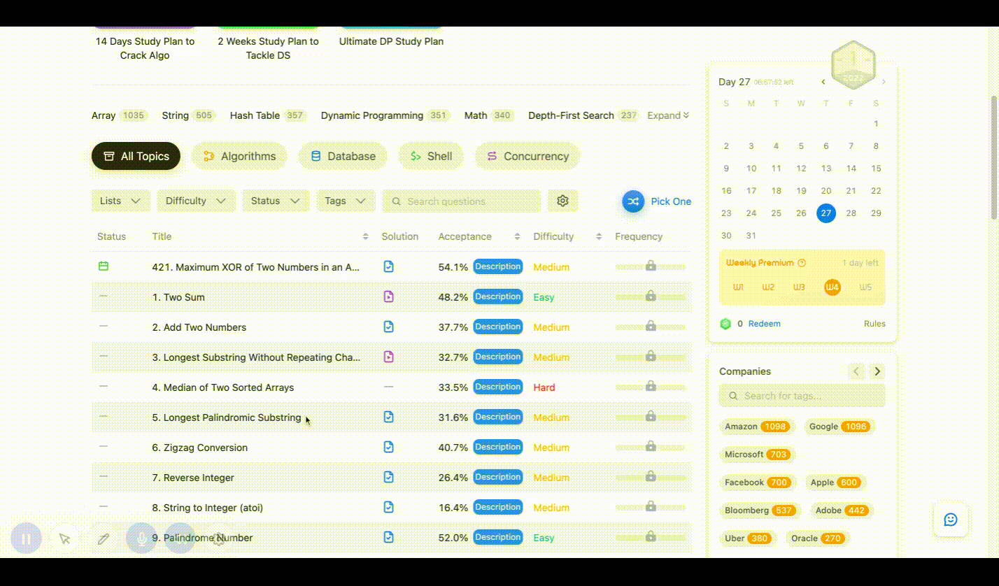

# 项目背景
  刷题时，每次都需要打开新的tab或跳转到新页面查看当前题目描述和题解，体验都不是特别爽，所以开发该插件用于可快速浏览题和题解
# 线上链接   
  https://chrome.google.com/webstore/detail/leetcode-assistant/ggambmdfebjbbdjpobhppdkcjbdiicle

# 使用技术
  Vue3 + Vite + Antdv
  
  
  
